# TP1 👩‍🏫

## Table des matières

[Exercice 1](#exercice-1-🧮)
   - [Partie 1](#partie-1-🛠️)
   - [Partie 2](#partie-2-🧩)
[Exercice 2](#exercice-2-🧮)
[Exercice 3](#exercice-3-🧮)
[Exercice 4](#exercice-4-🧮)
[Exercice 5](#exercice-5-🧮)
## Exercice 1 🧮

### Partie 1 🛠️

1. [binaire.lex](./Exercice1/binaire.lex)
2.

- Programme Flex pour déterminer si une chaîne est un nombre binaire ou non.
- Commande à exécuter :

```bash
make exercice1-partie1
```

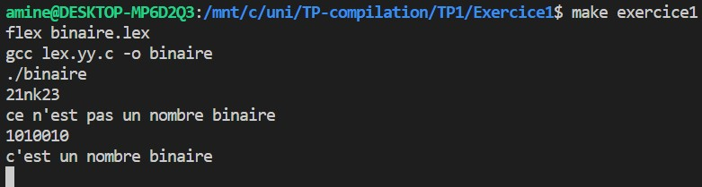

4. Pour exécuter le programme binaire avec un fichier en entrée, utilisez la commande suivante :

```bash
make exercice1-partie1 ARGS=in.txt
```

- Pour permettre au programme d'écrire le résultat dans un fichier `resultat.txt`, vous devez changer le yyout de Flex pour qu'il pointe vers un fichier, comme suit :

```c
yyout = fopen("resultat.txt", "w");
```

- Sinon, assignez yyout à stdout :

```c
yyout = stdout;
```

- Ensuite, vous devez modifier les instructions printf pour écrire dans le yyout, qui peut être soit resultat.txt soit stdout :

```c
fprintf(yyout, "C'est un nombre binaire");
```

- Ainsi, si vous exécutez cette commande :

```bash
make exercice1-partie1 ARGS=in.txt
```

- Vous obtenez un fichier resultat.txt.

| Entrée                                   | Sortie                                    |
| ---------------------------------------- | ----------------------------------------- |
| 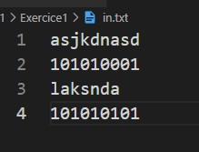 | 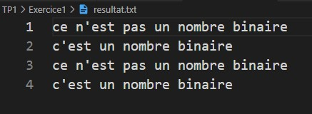 |

- Remarque : En cas d'utilisation du WSL comme moi, exécutez cette commande sur in.txt pour supprimer les caractères invisibles :

```bash
sed -i 's/[^[:print:]]//g' in.txt
```

### Partie 2 🧩

1. [partie2.lex](./Exercice1/partie2.lex)

2. Résultat du code sur les entrées : "babbaaab", "abbb", "aabb", "baabbbb", "bbaabbba", "baabbbbab", "aaabbbba".

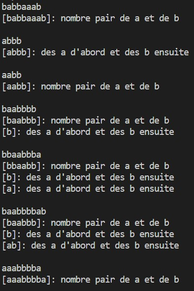

3. Après avoir permuté ces deux lignes :

```c
a*b* printf("[%s]: des a d'abord et des b ensuite\n", yytext);
{pairpair} printf("[%s]: nombre pair de a et de b\n", yytext);
```

- On obtient :

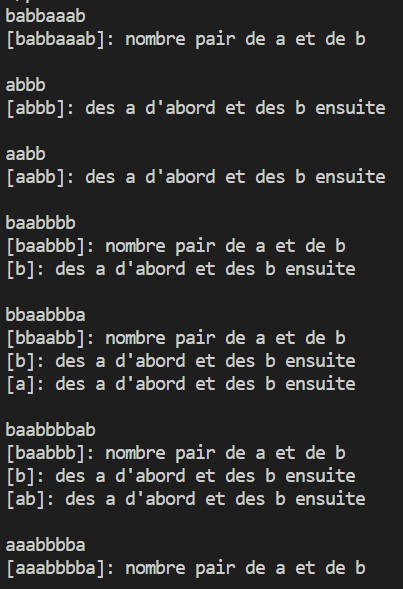

4. Il y a une différence dans le mot "aabb" car ce mot appartient à {pairpair} et à a*b*, donc le message qui sera écrit est celui de l'expression régulière qui vient en premier.

5. [analyseur lexicale qui permet de reconnaitre l'unite lexicale id](./Exercice1/id-nb.lex)

```bash
make exercice1-id-nb
```

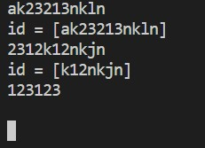

6.  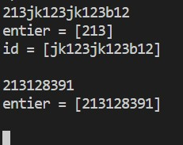

## Exercice 2 🧮

```bash
make exercice2 ARGS=in.txt
```

| Entrée                                   | Sortie                                    |
| ---------------------------------------- | ----------------------------------------- |
| 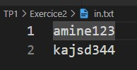 | 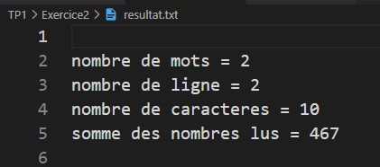 |

## Exercice 3 🧮

```bash
make exercice3 ARGS=in.txt
```

| Entrée                                   | Sortie                                    |
| ---------------------------------------- | ----------------------------------------- |
| 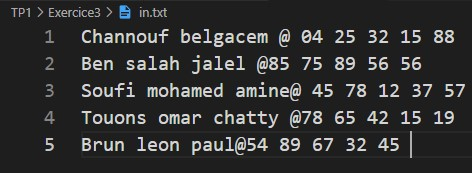 | 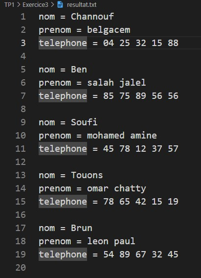 |

## Exercice 4 🧮

```bash
make exercice4 ARGS=in.txt
```

| Entrée                                   | Sortie                                    |
| ---------------------------------------- | ----------------------------------------- |
| 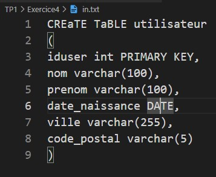 | 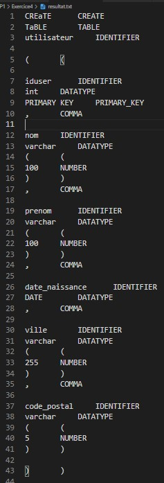 |

## Exercice 5 🧮

```bash
make exercice5 ARGS=in.txt
```

| Entrée                                   | Sortie                                    |
| ---------------------------------------- | ----------------------------------------- |
| 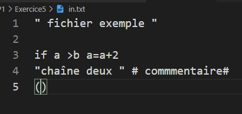 | 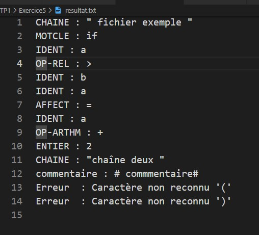 |
