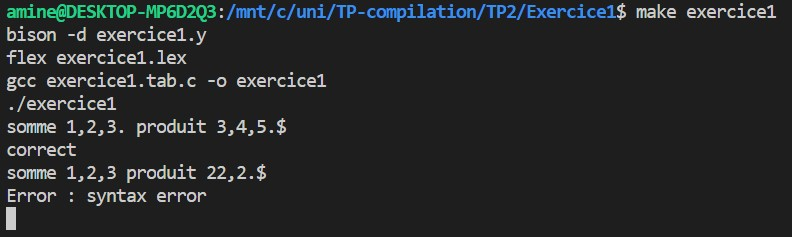
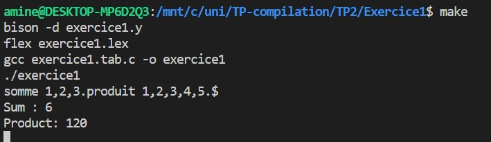
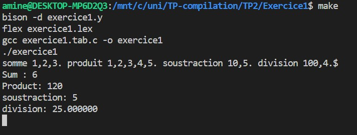

# TP1 👩‍🏫

## Table des matières

- [Exercice 1](#exercice-1-🧮)
- [Exercice 2](#exercice-2-🧮)

## Exercice 1 🧮

Dans cet exercice, nous avons développé un analyseur syntaxique capable de reconnaître des instructions de la forme suivante : `somme 1, 2, 3. produit 2, 5.`

### Commande à exécuter :

Pour lancer l'exercice 1, exécutez la commande suivante dans votre terminal :

```bash
make exercice1
```

### Résultat :



### Affichage de la somme et du produit :

```c
liste: FIN
     | SOM listesom '.' { printf("Somme avant : %d\n", sum); sum = 0;} liste
     | PROD listeprod '.' { printf("Produit : %d\n", product); product = 1; } liste ;

listesom: NB { sum += $1; }
        | listesom ',' NB { sum += $3; };

listeprod: NB { product *= $1; }
         | listeprod ',' NB { product *= $3; };
```

**Explication :**

- Dans la règle `liste`, des actions ont été ajoutées après la détection de SOM et PROD. Ces actions impriment respectivement la somme ou le produit actuel, puis réinitialisent la variable correspondante.
- Pour la somme, dans `listesom`, chaque nombre est ajouté à la variable `sum`. Si plusieurs nombres sont détectés séparés par des virgules, leurs sommes sont ajoutées à `sum`.
- Pour le produit, dans `listeprod`, chaque nombre est multiplié avec la variable `product`. De même, si plusieurs nombres sont détectés, leurs produits sont multipliés avec `product`.

### Résultat :



### Ajout de la soustraction et de la division à l'analyseur syntaxique

Nous avons étendu la fonctionnalité de l'analyseur syntaxique pour inclure la soustraction et la division, offrant ainsi une plus grande variété de calculs à traiter.

### Résultat :



## Exercice 2 🧮

Dans cet exercice, nous avons développé un analyseur syntaxique pour les requêtes SQL de la forme `CREATE TABLE utilisateur(nom varchar(100), prenom varchar(100), ville varchar(255));`.

### Commande à exécuter :

Pour lancer l'exercice 2, exécutez la commande suivante dans votre terminal :

```bash
make exercice2
```

### Résultat :


Ce travail a permis de créer un analyseur syntaxique capable de vérifier la syntaxe des requêtes SQL, offrant ainsi une meilleure compréhension et un traitement précis des instructions de création de table.